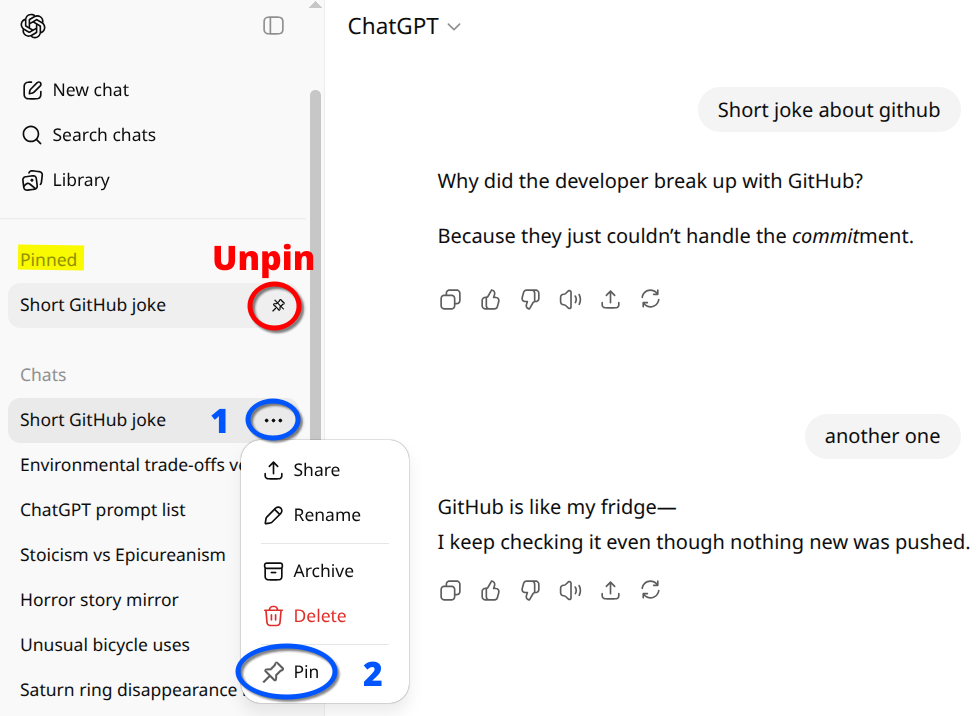

# PinGPTChat - Chat Pinner Extension

## Overview

**PinGPTChat** is a lightweight and efficient browser extension that allows users to pin important chats in ChatGPT. With an intuitive interface and simple controls, this extension ensures that your most critical conversations are always easily accessible.

## History
 
*I started using chatgpt from the first weeks of its appearance.
During this time I have accumulated a huge number of chats and some of them are very important to me.
And therefore in order not to lose sight of them I wanted a way to pin them for quick access.
I went online, BUT to my surprise, I only found a couple of alternatives - 
(like PinFold)[https://chromewebstore.google.com/detail/pinfold-chatgpt-folder-an/ookinnlmhenbmdkhmnnpomnalaiijlkh], which allows you to pin just one chat for free and costs around $5
and (Pinnable ChatGPT)[https://chromewebstore.google.com/detail/pinnable-chatgpt-pin-gpt/gkcoljnpncflkbpfdclfnilimianfech?hl=en], which lets you pin three but then asks you to pay $10 to pin more
I was **shocked/amazed**—how could such an **elementary and fundamental** thing have a price?  
This got me thinking, and I decided to **create my own free solution**, because something this simple should be available to everyone.*

## Features

- **you can  -  pin chats:** Quickly pin your important chats in ChatGPT for easy access.
- **you can  -  unpin chats:** Unpin chats when they are no longer needed.
  
+++ **Unlimited Pinned Chats:** No restrictions on the number of chats you can pin.

## Installation

### From the Edge Add-ons

1. Visit the [PinGPTChat](https://microsoftedge.microsoft.com/addons/detail/pingptchat/dcilfeialhablfeimfamjmfpohpccbeg).
2. Click "Install" to install the extension.

### Manual Installation

1. [Download the latest release](https://github.com/enoobis/PinGPTChat/releases).
2. Extract the contents of the zip file to a folder on your computer.
3. Open Chrome and navigate to `chrome://extensions/`.
4. Enable "Developer mode" using the toggle in the top right corner.
5. Click "Load unpacked" and select the folder where you extracted the extension files.

## Usage

After installing the extension, a "Pinned" section will automatically appear at the top of your chat history in the ChatGPT sidebar.

### Pinning a Chat

1.  Hover over any chat in the sidebar to reveal the three-dots menu icon.
2.  Click the **three-dots (...)** button to open the conversation options.
3.  A "**Pin**" option will appear in the menu. Click it to pin the chat.

### Viewing and Unpinning Chats

-   Pinned chats are grouped at the top of your sidebar under the "**Pinned**" heading for quick access.
-   To unpin a chat, you can either:
    1.  Click the three-dots menu on the pinned chat and select "Unpin".
    2.  Hover over the pinned chat and click the unpin icon that appears on the right.

---

## License

#### This project is licensed under the MIT License - see the [LICENSE](LICENSE)
*Wich means you can use, copy, modify and distribute the project freely you just need to include the original license file*

